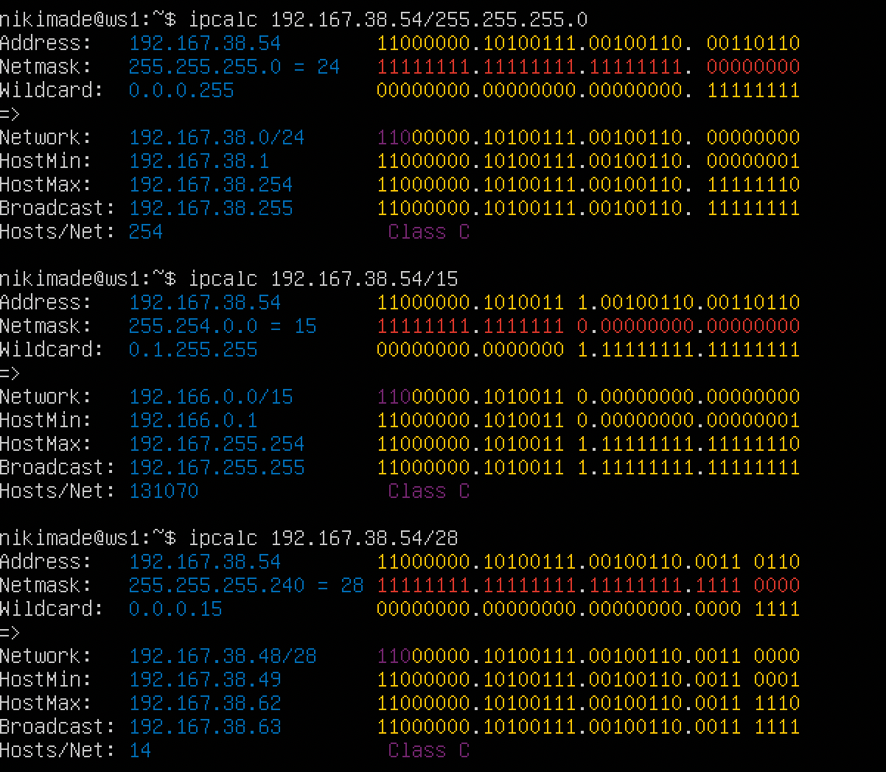
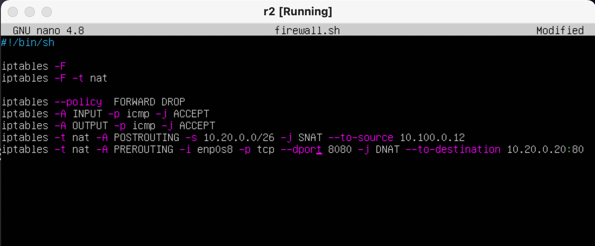

## Linux Network
## Contents
Part 1. [Инструмент ipcalc](#part-1-инструмент-ipcalc)

- 1.1. [Сети и маски](#11-сети-и-маски)
- 1.2. [localhost](#12-localhost)
- 1.3. [Диапазоны и сегменты сетей](#13-диапазоны-и-сегменты-сетей)

Part 2. [Статическая маршрутизация между двумя машинами](#part-2-статическая-маршрутизация-между-двумя-машинами)

- 2.1. [Добавление статического маршрута вручную](#21-добавление-статического-маршрута-вручную)
- 2.2. [Добавление статического маршрута с сохранением](#22-добавление-статического-маршрута-с-сохранением)

Part 3. [Утилита iperf3](#part-3-утилита-iperf3)

- 3.1. [Скорость соединения](#31-скорость-соединения)
- 3.2. [Утилита iperf3](#32-утилита-iperf3)

Part 4. [Сетевой экран](#part-4-сетевой-экран)

- 4.1. [Утилита iptables](#41-утилита-iptables)
- 4.2. [Утилита nmap](#42-утилита-nmap)

Part 5. [Статическая маршрутизация сети](#part-5-статическая-маршрутизация-сети)

- 5.1. [Настройка адресов машин](#51-настройка-адресов-машин)
- 5.2. [Включение переадресации IP-адресов](#52-включение-переадресации-ip-адресов)
- 5.3. [Установка маршрута по-умолчанию](#53-установка-маршрута-по-умолчанию)
- 5.4. [Добавление статических маршрутов](#54-добавление-статических-маршрутов)
- 5.5. [Построение списка маршрутизаторов](#55-построение-списка-маршрутизаторов)
- 5.6. [Использование протокола ICMP при маршрутизации](#56-использование-протокола-icmp-при-маршрутизации)

Part 6. [Динамическая настройка IP с помощью DHCP](#part-6-динамическая-настройка-ip-с-помощью-dhcp) \
Part 7. [NAT](#part-7-nat) \
Part 8. [Допополнительно. Знакомство с SSH Tunnels](#part-8-дополнительно-знакомство-с-ssh-tunnels)

## Part 1. Инструмент ipcalc

- Установила ipcalc

`sudo apt install ipcalc`

### 1.1. Сети и маски
 Префиксы маски сети - это набор значений, используемых для определения диапазона IP-адресов в сети. Они используются в связке с маской подсети для определения, какие IP-адреса принадлежат к одной подсети, а какие к другой.

Маска сети - это значение, используемое для определения диапазона IP-адресов в сети. Она используется вместе с IP-адресом для определения, какие адреса принадлежат к одной подсети, а какие к другой. Маска выражается в виде четырех десятичных чисел, разделенных точками, каждое из которых может принимать значение от 0 до 255.

Диапазон IP-адресов в сети - это группа адресов, назначенных устройствам в сети для идентификации и общения между ними. Каждый IP-адрес уникален в пределах сети, и их диапазон определяется посредством использования маски подсети.
    
1. Адрес сети 192.167.38.54/13
    
`ipcalc -n 192.167.38.54/13`


2. Перевела маску 255.255.255.0 в префиксную и двоичную запись

Перевод маски 255.255.255.0 в префиксную и двоичную запись происходит следующим образом:

Перевод в двоичную запись: каждое значение маски в десятичной форме переводится в двоичный код. Например, 255 в двоичном коде выглядит как 11111111. Получим двоичный код маски: 11111111.11111111.11111111.00000000

Перевод в префиксную запись: количество единиц в двоичном коде маски указывает на длину префикса. В данном случае, количество единиц равно 24, что означает, что префикс 255.255.255.0 в десятичной форме может быть записан как /24.
   
`ipcalc 192.167.38.54/255.255.255.0`

Перевод маски /15 в обычную и двоичную формы происходит следующим образом:

Перевод в обычную форму: каждый бит в маске может быть либо единицей (1), либо нулем (0). Число /15 указывает на количество единиц в маске. Таким образом, маска /15 в обычной форме может быть записана как 255.254.0.0

Перевод в двоичную форму: каждое значение в обычной форме переводится в двоичный код. Например, 255 в двоичном коде выглядит как 11111111. Получим двоичный код маски: 11111111.11111110.00000000.00000000.

`ipcalc 192.167.38.54/15`

Перевод 11111111.11111111.11111111.11110000 в обычную и префиксную форму маски происходит следующим образом:

Перевод в обычную форму: данное двоичное представление маски соответствует значению 255.255.255.240

Перевод в префиксную форму: количество единиц в маске определяет длину префикса. Таким образом, длина префикса для данной маски равна 28, то есть /28.

`ipcalc 192.167.38.54/28`



Минимальный и максимальный хосты в сети нужны для разделения IP-адресов в подсети на две части: одну для адресов устройств в сети и другую для адресов шлюзов или специальных адресов.

Минимальный хост - это первый доступный для использования IP-адрес в подсети, который может быть присвоен устройству в сети.

Максимальный хост - это последний доступный для использования IP-адрес в подсети, который может быть присвоен устройству в сети.

Использование минимального и максимального хостов помогает системам управления сетями лучше организовывать и администрировать адресацию IP в сети.

Минимальный и максимальный хост в сети 12.167.38.4 при маске /8
   
`ipcalc 12.167.38.4/8`


- 11111111.11111111.00000000.00000000

`ipcalc 12.167.38.4/16`

- 255.255.254.0

`ipcalc 12.167.38.4/255.255.254.0`

- /4

`ipcalc 12.167.38.4/4`


 ### 1.2. localhost

Loopback на localhost - это специальный IP-адрес (127.0.0.1), используемый для обращения к собственному компьютеру. Он используется для тестирования сетевых услуг и приложений на локальном компьютере, а также для установления сетевых соединений между различными приложениями на одном компьютере. Он также известен как loopback-интерфейс.

Адреса для локальных сетей:


1. Определилa, можно ли обратиться к приложению, работающему на localhost, со следующими IP:

- 194.34.23.100 - нельзя
- 127.0.0.2 - можно
- 127.1.0.1 - можно
- 128.0.0.1 - нельзя


### 1.3. Диапазоны и сегменты сетей

1. Определила, какие из перечисленных IP можно использовать в качестве публичного, а какие только в качестве частных: 10.0.0.45, 134.43.0.2, 192.168.4.2, 172.20.250.4, 172.0.2.1, 192.172.0.1, 172.68.0.2, 172.16.255.255, 10.10.10.10, 192.169.168.1
    
IP-адреса можно разделить на две категории: публичные и частные. Публичные IP-адреса могут быть использованы для подключения к Интернету, тогда как частные IP-адреса используются только внутри частных сетей.
    
Диапазоны частных сетей:


П - публичный
Ч - частный


Определила, какие из перечисленных IP адресов шлюза возможны у сети 10.10.0.0/18: 10.0.0.1, 10.10.0.2, 10.10.10.10, 10.10.100.1, 10.10.1.255


Смотрим диапазон между 'Hostmin' и 'Hostmax'.

У сети 10.10.0.0/18 возможны данные IP адреса шлюза: 10.10.0.2, 10.10.10.10, 10.10.1.255; 

#### [Вернуться к оглавлению](#linux-network)

## Part 2. Статическая маршрутизация между двумя машинами

1. С помощью команды ip a посмотрела существующие сетевые интерфейсы


2. Описала сетевой интерфейс, соответствующий внутренней сети, на обеих машинах и задала следующие адреса и маски:

ws1 - 192.168.100.10, маска /16

ws2 - 172.24.116.8, маска /12


3. Выполнила команду netplan apply для перезапуска сервиса сети и снова посмотрела существующие сетевые интерфейсы


### 2.1. Добавление статического маршрута вручную

`"Пропинговать соединение"` означает отправлять сетевые пакеты для проверки доступности удаленной машины или сетевого устройства. Это может быть использовано, чтобы определить, работает ли сетевое соединение между двумя машинами, или если одна из машин недоступна, по какой причине. 

- Пропинговала соединение между машинами


### 2.2. Добавление статического маршрута с сохранением
Добавила статический маршрут от одной машины до другой с помощью файла etc/netplan/00-installer-config.yaml, проверила соединение между машинами, затем перезагрузила машины и еще раз проверила соединение.


- Пропинговала соединение между машинами


#### [Вернуться к оглавлению](#linux-network)

## Part 3. Утилита iperf3

- Установила iperf3

### 3.1. Скорость соединения

    8 Mbps = 1 MB/s
    100 MB/s = 100000 Kbps
    1 GB/S = 1000 Mbps

### 3.2. Утилита iperf3

1. Запустила на сервере iperf3 -s

2. Запустила в клиенте iperf3 -c 192.168.100.10 -p 5201


#### [Вернуться к оглавлению](#linux-network)

## Part 4. Сетевой экран

### 4.1. Утилита iptables

Утилита `iptables` служит для проверки сетевых пакетов. В фильтре `iptables` все пакеты делятся на три основные цепочки:
- `input` - обрабатывает входящие пакеты и подключения
- `forward` - применяется для проходящих соединений
- `output` - используется для исходящих пакетов и соединений
  а также существуют две вспомогательные:
- `prerouting` - в эту цепочку пакет попадает перед обработкой iptables, система еще не знает куда он будет отправлен, в input, output или forward;
- `postrouting` - сюда попадают все проходящие пакеты, которые уже прошли цепочку forward.

Для каждого типа пакетов можно установить набор правил, которые по очереди будут проверяться на соответствие с пакетом и если пакет соответствует, то применять к нему указанное в правиле действие. Правила образуют цепочку, поэтому input, output и forward называют цепочками, цепочками правил. Действий может быть несколько:

- **ACCEPT** - разрешить прохождение пакета дальше по цепочке правил;
- **DROP** - удалить пакет;
- **REJECT** - отклонить пакет, отправителю будет отправлено сообщение, что пакет был отклонен;
- **LOG** - сделать запись о пакете в лог файл;
- **QUEUE** - отправить пакет пользовательскому приложению.

Над цепочками правил в iptables есть еще один уровень абстракции, и это таблицы. В системе есть несколько таблиц, и все они имеют стандартный набор цепочек input, forward и output. Таблицы предназначены для выполнения разных действий над пакетами, например для модификации или фильтрации.

- **raw** - предназначена для работы с сырыми пакетами, пока они еще не прошли обработку;
- **mangle** - предназначена для модификации пакетов;
- **nat** - обеспечивает работу nat, если вы хотите использовать компьютер в качестве маршрутизатора;
- **filter** - основная таблица для фильтрации пакетов, используется по умолчанию.

1. Создала файл /etc/firewall.sh, имитирующий фаерволл, на ws1 и ws2
  
    `sudo touch /etc/firewall.sh`

2. Содержание файла /etc/firewall.sh для машины ws1

    1) применила стратегию, когда в начале пишется запрещающее правило, а в конце пишется разрешающее правило

    2) открыла на машине доступ для порта 22 (ssh) и порта 80 (http)

    3) запретила echo reply (машина не должна "пинговаться”, т.е. должна быть блокировка на OUTPUT)

    4) разрешила echo reply (машина должна "пинговаться")
``` brew
Правила должны выполняться сверху-вниз, следовательно, если правило 
запрета находиться выше оно срабатывает, а правило разрешения 
находящиеся ниже нет. 
Следовательно 1-ая машина не пингуется, а 2-ая пингуется.
```

* Содержание файла /etc/firewall.sh для машины ws2

    1) применила стратегию, когда в начале пишется разрешающее правило, а в конце пишется запрещающее правило

    2) открыла на машине доступ для порта 22 (ssh) и порта 80 (http)

    3) разрешила echo reply (машина должна "пинговаться")

    4) запретила echo reply (машина не должна "пинговаться”, т.е. должна быть блокировка на OUTPUT)

``` brew
Так как утилита iptabels выполняет первое прочитанное правило, 
разница между стратегиями заключается в порядке команд. 
- Для машины ws1 первой стоит команда DROP - отклонить пакет. 
Будет выполнятся этот запрет и пинг не пройдет. 
- Для машины ws2 напротив, первым стоит ACCEPT - разрешить 
прохождение пакета. Пинг проходит.
```


* Запустила файлы на обеих машинах командой 
* 
    `sudo chmod +x /etc/firewall.sh && sudo sh /etc/firewall.sh`


### 4.2. Утилита nmap

* Пингую ws1

* Пингую ws2 и вызываю команду nmap


#### [Вернуться к оглавлению](#linux-network)

## Part 5. Статическая маршрутизация сети

### 5.1. Настройка адресов машин

1. Настроила конфигурации машин в etc/netplan/00-installer-config.yaml согласно сети на рисунке


2. Командой ip -4 a проверила, что адрес машины задан верно.


3. Также пропинговала ws22 с ws21.


4. Аналогично пропинговала r1 с ws11


### 5.2. Включение переадресации IP-адресов.

* Для включения переадресации IP, выполнила команду на роутерах: sysctl -w net.ipv4.ip_forward=1


* Открыла файл /etc/sysctl.conf и добавила в него следующую строку: net.ipv4.ip_forward = 1


### 5.3. Установка маршрута по-умолчанию

1. Настроила маршрут по-умолчанию (шлюз) для рабочих станций. Для этого добавила default в файле конфигураций.


2. Вызвала ip r и показала, что добавился маршрут в таблицу маршрутизации.


3. Пропинговала с ws11 роутер r2 и показала на r2, что пинг доходит. Для этого использовала команду: tcpdump


### 5.4. Добавление статических маршрутов

1. Добавила в роутеры r1 и r2 статические маршруты в файле конфигураций.


2. Вызвала ip r и показала таблицы с маршрутами на обоих роутерах.


3. Запустила команды на ws11: ip r list 10.10.0.0/[маска сети] и ip r list 0.0.0.0/0


* "ip r list 10.10.0.0/[маска сети]" показывает пути именно к сети 10.10.0.0/18, а "ip r list 0.0.0.0/0 показывает пути к любой доступной сети с любой маской

### 5.5. Построение списка маршрутизаторов

1. Запустила на r1 команду дампа: tcpdump -tnv -i eth0

2. При помощи утилиты traceroute построила список маршрутизаторов на пути от ws11 до ws21


- Для определения промежуточных маршрутизаторов traceroute отправляет целевому узлу серию ICMP-пакетов (по умолчанию 3 пакета), с каждым шагом увеличивая значение поля TTL («время жизни») на 1. Это поле обычно указывает максимальное количество маршрутизаторов, которое может быть пройдено пакетом. Первая серия пакетов отправляется с TTL, равным 1, и поэтому первый же маршрутизатор возвращает обратно ICMP-сообщение «time exceeded in transit», указывающее на невозможность доставки данных. Traceroute фиксирует адрес маршрутизатора, а также время между отправкой пакета и получением ответа (эти сведения выводятся на монитор компьютера). Затем traceroute повторяет отправку серии пакетов, но уже с TTL, равным 2, что заставляет первый маршрутизатор уменьшить TTL пакетов на единицу и направить их ко второму маршрутизатору. Второй маршрутизатор, получив пакеты с TTL=1, так же возвращает «time exceeded in transit».

Процесс повторяется до тех пор, пока пакет не достигнет целевого узла, тем самым увеличивая значение ttl. При получении ответа от этого узла процесс трассировки считается завершённым.

### 5.6. Использование протокола ICMP при маршрутизации

1. Запустила на r1 перехват сетевого трафика, проходящего через eth0 с помощью команды: tcpdump -n -i eth0 icmp


2. Пропинговала с ws11 несуществующий IP (10.30.0.111) с помощью команды: ping -c 1 10.30.0.111


#### [Вернуться к оглавлению](#linux-network)

## Part 6. Динамическая настройка IP с помощью DHCP

1. Для r2 настроила в файле /etc/dhcp/dhcpd.conf конфигурацию службы DHCP: указала адрес маршрутизатора по-умолчанию, DNS-сервер и адрес внутренней сети.


2. В файле /etc/resolv.conf прописала nameserver 8.8.8.8


Перезагрузила службу DHCP командой `systemctl restart isc-dhcp-server`. 
Машину ws21 перезагрузила при помощи `reboot` и через ip a показала, что она получила адрес.


* Также пропинговала ws21 с ws22.


Указала MAC адрес у ws11, для этого в etc/netplan/00-installer-config.yaml добавила строки: `macaddress: 10:10:10:10:10:BA`, `dhcp4: true`


Для r1 настроила аналогично r2, но сделала выдачу адресов с жесткой привязкой к MAC-адресу (ws11). 


* В файле /etc/resolv.conf прописала nameserver 8.8.8.8


* В данном пункте я пользовалась опциями: 
    `dhclient -r`
    `dhclient -v`

#### [Вернуться к оглавлению](#linux-network)

## Part 7. NAT

1. В файле /etc/apache2/ports.conf на ws22 и r1 изменила строку Listen 80 на Listen 0.0.0.0:80, то есть сделала сервер Apache2 общедоступным и запустила веб-сервер Apache командой service apache2 start на ws22 и r1


2. Добавила в фаервол, созданный по аналогии с фаерволом из Части 4, на r2 следующие правила:

    1) Удаление правил в таблице filter - iptables -F

    2) Удаление правил в таблице "NAT" - iptables -F -t nat

    3) Отбрасывать все маршрутизируемые пакеты - iptables --policy FORWARD DROP


3. Запустила файл командой sudo chmod +x firewall.sh && sudo sh firewall.sh

4. Проверила соединение между r1 и ws22 командой ping (При запуске файла с этими правилами, ws22 не должна "пинговаться" с r1)
  


5. Добавила в файл ещё одно правило: 

    1) Разрешить маршрутизацию всех пакетов протокола ICMP


* Запустила файл командой sudo chmod +x firewall.sh && sudo sh firewall.sh

6. Проверила соединение между ws22 и r1 командой ping (При запуске файла с этими правилами, r1 должна "пинговаться" с ws22)


7. Добавила в файл ещё два правила: 
* Включить SNAT, а именно маскирование всех локальных ip из локальной сети, находящейся за r2 (по обозначениям из Части 5 - сеть 10.20.0.0)
* Включить DNAT на 8080 порт машины r2 и добавить к веб-серверу Apache, запущенному на ws22, доступ извне сети



* Запустила файл командой sudo chmod +x /etc/firewall.sh && sudo sh/etc/firewall.sh

Проверить соединение по TCP для SNAT, для этого с ws22 подключиться к серверу Apache на r1 командой:

    `telnet [адрес] [порт]`


8.  Проверила соединение по TCP для DNAT, для этого с r1 подключиться к серверу Apache на ws22 командой telnet (обращаться по адресу r2 и порту 8080)


#### [Вернуться к оглавлению](#linux-network)

## Part 8. Дополнительно. Знакомство с SSH Tunnels

Local TCP forwarding - это технология перенаправления сетевых трафиков используемая в компьютерных системах. Она позволяет перенаправлять сетевые запросы, которые приходят на один компьютер, на другой компьютер внутри локальной сети. Это может быть полезно, например, для доступа к веб-серверу или базе данных на локальном компьютере с другого компьютера в той же сети.

- Запустила на r2 фаервол с правилами из Части 7

- Запустила веб-сервер Apache на ws22 только на localhost (то есть в файле /etc/apache2/ports.conf изменила строку Listen 80 на Listen localhost:80)

    - ws22 apache ports conf

    

- Воспользовалась Local TCP forwarding с ws21 до ws22, чтобы получить доступ к веб-серверу на ws22 с ws21

    Использую ssh подключение с ws21 к ws22 с флагом -L, указывая сначала localhost, затем адрес и порт ws22

     

    Запустила telnet

     

- Воспользовалась Remote TCP forwarding c ws11 до ws22, чтобы получить доступ к веб-серверу на ws22 с ws11

    Использую ssh подключение c ws11 до ws22 с флагом -R, указывая сначала IP и порт ws22, затем указывая localhost

    Запустила telnet

    
